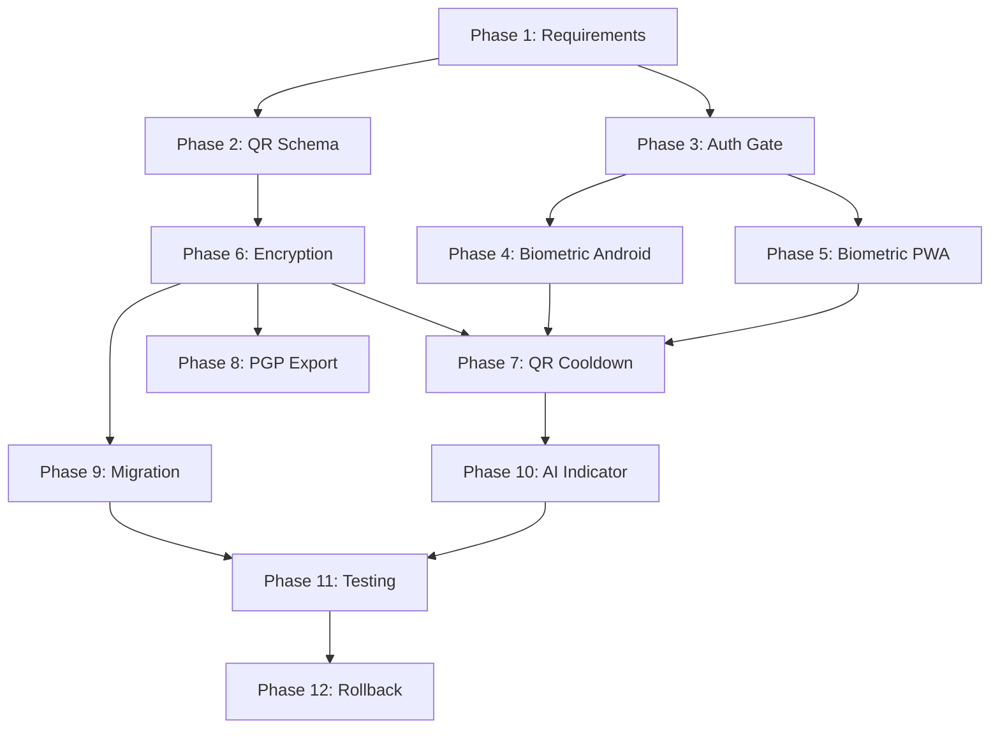

# Implementation Plan: Offline Biometric + QR Unlock + Encrypted Local Storage

> **Status:** Ready for Implementation
> **Created:** 2026-01-14
> **Target Platforms:** Android Native (Capacitor) + PWA
> **Privacy Model:** Fully offline, GDPR-safe, local-only

---

## Executive Summary

This plan implements a comprehensive security layer for NeuroLogg Pro with:
- **Biometric authentication** required on every app open
- **QR code validation** required every 30 minutes (TTL-based)
- **AES-256-GCM encrypted storage** for all sensitive data
- **PGP-encrypted exports** for secure data portability
- **Full offline capability** with no cloud dependencies

---

## Table of Contents

1. [Requirements & Threat Model](#phase-1-requirements--threat-model)
2. [QR Payload & Key Strategy](#phase-2-qr-payload--key-strategy)
3. [Auth Gate & Context](#phase-3-auth-gate--context)
4. [Biometric (Android)](#phase-4-biometric-android)
5. [Biometric (PWA/WebAuthn)](#phase-5-biometric-pwawebauthn)
6. [Encryption & Storage Abstraction](#phase-6-encryption--storage-abstraction)
7. [QR Cooldown Enforcement](#phase-7-qr-cooldown-enforcement)
8. [Export Encryption with PGP](#phase-8-export-encryption-with-pgp)
9. [Data Migration](#phase-9-data-migration)
10. [AI Clarity Indicator](#phase-10-ai-clarity-indicator)
11. [Testing & Verification](#phase-11-testing--verification)
12. [Rollback Plan](#phase-12-rollback-plan)

---

## Phase 1: Requirements & Threat Model

### Overview
Establish security constraints, threat model, and unlock lifecycle before implementation.

### Tasks

- [ ] **1.1 Document Security Constraints**
  - [ ] Confirm offline-only requirement (no cloud in production)
  - [ ] Confirm Android APK + PWA parity requirement
  - [ ] Document GDPR compliance requirements
  - [ ] Define supported biometric methods (fingerprint, faceId, iris)

- [ ] **1.2 Define Threat Model**
  - [ ] **Threat: Device Loss**
    - Mitigation: Encrypted storage + biometric lock
    - Risk Level: High
  - [ ] **Threat: Unauthorized Access (family member, coworker)**
    - Mitigation: Biometric + QR dual-factor
    - Risk Level: High
  - [ ] **Threat: Export Leakage**
    - Mitigation: PGP-encrypted exports only
    - Risk Level: Medium
  - [ ] **Threat: Shoulder Surfing**
    - Mitigation: Biometric (no visible PIN)
    - Risk Level: Low

- [ ] **1.3 Categorize Sensitive Data**
  | Category | Storage Key | Sensitivity | Encryption Required |
  |----------|-------------|-------------|---------------------|
  | Emotion Logs | `kreativium_logs` | High | Yes |
  | Crisis Events | `kreativium_crisis_events` | Critical | Yes |
  | Audio Recordings | Filesystem blobs | Critical | Yes |
  | Schedule Data | `kreativium_schedule_entries` | Medium | Yes |
  | Goals | `kreativium_goals` | Medium | Yes |
  | Child Profile | `kreativium_child_profile` | Critical | Yes |
  | Analysis Settings | `kreativium_analysis_settings` | Low | Optional |

- [ ] **1.4 Define Unlock Policy**
  - [ ] Biometric: Required on EVERY app open (cold start + resume)
  - [ ] QR: Required if `now - lastQrAt > 30 minutes`
  - [ ] Session timeout: Lock after 5 minutes of inactivity (configurable)
  - [ ] Manual lock: User can lock immediately via settings

- [ ] **1.5 Define Unlock Lifecycle States**
  ```typescript
  type AuthState =
    | 'locked'           // Initial state, no access
    | 'biometricPending' // Awaiting biometric verification
    | 'qrPending'        // Biometric passed, QR expired
    | 'unlocked'         // Full access granted
    | 'error'            // Authentication failed
  ```

### Deliverables
- [ ] `docs/SECURITY.md` - Written threat model & privacy assumptions
- [ ] `src/types.ts` - AuthState type definition
- [ ] `src/constants/auth.ts` - Auth configuration constants

### Acceptance Criteria
- [ ] All team members understand threat model
- [ ] Unlock lifecycle states documented
- [ ] Data categories mapped to encryption requirements

---

## Phase 2: QR Payload & Key Strategy

### Overview
Design the QR code payload structure for device enrollment and session validation.

### Tasks

- [ ] **2.1 Define QR Payload Schema**
  ```typescript
  // src/types.ts
  interface QRPayload {
    version: '1.0.0'
    deviceKey: string      // 256-bit secret, base64 encoded
    pgpPublicKey: string   // ASCII armored PGP public key
    issuedAt: string       // ISO 8601 timestamp
    expiresAt?: string     // Optional expiration for enrollment QRs
    permissions: {
      canExport: boolean
      canDeleteData: boolean
      canModifyProfile: boolean
    }
  }
  ```

- [ ] **2.2 Create Zod Schema for Validation**
  ```typescript
  // src/utils/qrPayloadSchema.ts
  import { z } from 'zod'

  export const QRPayloadSchema = z.object({
    version: z.literal('1.0.0'),
    deviceKey: z.string().min(43).max(44), // base64 256-bit
    pgpPublicKey: z.string().startsWith('-----BEGIN PGP PUBLIC KEY BLOCK-----'),
    issuedAt: z.string().datetime(),
    expiresAt: z.string().datetime().optional(),
    permissions: z.object({
      canExport: z.boolean(),
      canDeleteData: z.boolean(),
      canModifyProfile: z.boolean(),
    }),
  })
  ```

- [ ] **2.3 Implement QR Parser**
  - [ ] Create `parseQrPayload(qrData: string): QRPayloadResult`
  - [ ] Define error codes:
    - `INVALID_JSON` - QR data is not valid JSON
    - `SCHEMA_MISMATCH` - Doesn't match expected schema
    - `EXPIRED` - QR has expired
    - `VERSION_UNSUPPORTED` - Unknown version
    - `KEY_INVALID` - Device key validation failed

- [ ] **2.4 Define Key Derivation Strategy**
  ```
  MasterKey = HKDF-SHA256(
    inputKeyMaterial: deviceKey (from QR),
    salt: device-specific-salt (from Android Keystore / IndexedDB),
    info: "neurologg-storage-v1",
    length: 256 bits
  )
  ```

- [ ] **2.5 Document Rotation Policy**
  - [ ] QR rotation: Manual only (admin-initiated)
  - [ ] Device key rotation: On QR re-enrollment
  - [ ] Storage re-encryption: Required on rotation

### Subtasks

- [ ] **2.5.1 Create QR Generation Utility (Admin Tool)**
  - [ ] Generate cryptographically secure deviceKey
  - [ ] Accept PGP public key input
  - [ ] Output printable QR code
  - [ ] Store backup of device keys securely

- [ ] **2.5.2 Document QR Provisioning Flow**
  ```
  1. Admin generates QR with `npx neurologg-qr-gen`
  2. Admin prints QR and stores securely
  3. User scans QR on first launch (enrollment)
  4. Device stores encrypted deviceKey reference
  5. Subsequent unlocks verify QR matches enrolled key
  ```

### Files to Create
- [ ] `src/utils/qrPayloadSchema.ts` - Zod schema + parser
- [ ] `src/services/qrService.ts` - QR validation service
- [ ] `scripts/generate-qr.ts` - Admin QR generation tool
- [ ] `docs/QR_PROVISIONING.md` - Provisioning documentation

### Acceptance Criteria
- [ ] QR payload schema defined and validated with Zod
- [ ] Parser returns typed errors for all failure modes
- [ ] Key derivation strategy documented

---

## Phase 3: Auth Gate & Context

### Overview
Create the authentication gate that blocks app initialization until unlocked.

### Tasks

- [ ] **3.1 Create AuthContext**
  ```typescript
  // src/contexts/AuthContext.tsx
  interface AuthContextType {
    state: AuthState
    biometricAvailable: boolean
    qrEnrolled: boolean
    lastQrValidation: Date | null
    qrTTLRemaining: number // seconds

    // Actions
    requestBiometric: () => Promise<boolean>
    validateQR: (qrData: string) => Promise<QRValidationResult>
    lock: () => void

    // Enrollment
    enrollBiometric: () => Promise<boolean>
    enrollQR: (qrData: string) => Promise<EnrollmentResult>

    // Error state
    error: AuthError | null
    clearError: () => void
  }
  ```

- [ ] **3.2 Create AuthGate Component**
  ```typescript
  // src/components/AuthGate.tsx
  export const AuthGate: React.FC<{ children: React.ReactNode }> = ({ children }) => {
    const { state } = useAuth()

    switch (state) {
      case 'locked':
        return <LockScreen />
      case 'biometricPending':
        return <BiometricPrompt />
      case 'qrPending':
        return <QRScanScreen />
      case 'error':
        return <AuthErrorScreen />
      case 'unlocked':
        return <>{children}</>
    }
  }
  ```

- [ ] **3.3 Integrate AuthGate in App.tsx**
  ```typescript
  // src/App.tsx
  function App() {
    return (
      <AuthProvider>
        <AuthGate>
          <DataProvider>
            <RouterProvider router={router} />
          </DataProvider>
        </AuthGate>
      </AuthProvider>
    )
  }
  ```

- [ ] **3.4 Implement State Machine**
  ```
  locked → biometricPending (on app open)
  biometricPending → qrPending (biometric success, QR expired)
  biometricPending → unlocked (biometric success, QR valid)
  biometricPending → error (biometric failed)
  qrPending → unlocked (QR validated)
  qrPending → error (QR invalid)
  unlocked → locked (manual lock / timeout / app background)
  error → locked (dismiss error)
  ```

- [ ] **3.5 Add AppState Hooks**
  - [ ] Lock on app background (if configured)
  - [ ] Lock on resume after timeout
  - [ ] Handle Capacitor `appStateChange` event

### Subtasks

- [ ] **3.5.1 Create Lock Screen UI**
  - [ ] App logo and name
  - [ ] "Tap to unlock" button (triggers biometric)
  - [ ] Loading state during verification
  - [ ] Error message display

- [ ] **3.5.2 Create QR Scan Screen UI**
  - [ ] Camera viewfinder with QR overlay
  - [ ] "Scan your unlock QR" instructions
  - [ ] Manual entry fallback (paste QR data)
  - [ ] Cancel/back to biometric option

- [ ] **3.5.3 Create Auth Error Screen UI**
  - [ ] Error message with code
  - [ ] Retry button
  - [ ] Help/support link
  - [ ] Emergency access option (if configured)

### Files to Create
- [ ] `src/contexts/AuthContext.tsx` - Auth state management
- [ ] `src/components/AuthGate.tsx` - Gate wrapper component
- [ ] `src/components/auth/LockScreen.tsx` - Lock screen UI
- [ ] `src/components/auth/BiometricPrompt.tsx` - Biometric UI
- [ ] `src/components/auth/QRScanScreen.tsx` - QR scan UI
- [ ] `src/components/auth/AuthErrorScreen.tsx` - Error UI

### Files to Modify
- [ ] `src/App.tsx` - Wrap with AuthProvider + AuthGate
- [ ] `src/store/index.tsx` - Export AuthProvider

### Acceptance Criteria
- [ ] AuthGate blocks ALL data hydration until unlocked
- [ ] State machine transitions are explicit and testable
- [ ] UI provides clear feedback for each state

---

## Phase 4: Biometric (Android)

### Overview
Implement native biometric authentication for Android using AndroidX Biometric API.

### Tasks

- [ ] **4.1 Install Capacitor Biometric Plugin**
  ```bash
  npm install @capawesome/capacitor-android-biometric
  npx cap sync android
  ```

  Alternative (if custom plugin needed):
  - [ ] Create custom BiometricPlugin.java

- [ ] **4.2 Add Android Permissions**
  ```xml
  <!-- android/app/src/main/AndroidManifest.xml -->
  <uses-permission android:name="android.permission.USE_BIOMETRIC" />
  <uses-permission android:name="android.permission.USE_FINGERPRINT" />
  ```

- [ ] **4.3 Create Biometric Service Wrapper**
  ```typescript
  // src/services/biometricAuth.android.ts
  import { registerPlugin } from '@capacitor/core'

  interface BiometricPlugin {
    isAvailable(): Promise<{ available: boolean; biometryType: string }>
    authenticate(options: {
      reason: string
      title: string
      subtitle?: string
      negativeButtonText: string
    }): Promise<{ success: boolean }>
    checkEnrollment(): Promise<{ enrolled: boolean }>
  }

  const Biometric = registerPlugin<BiometricPlugin>('Biometric')

  export async function isBiometricAvailable(): Promise<boolean> {
    if (!isAndroid()) return false
    const result = await Biometric.isAvailable()
    return result.available
  }

  export async function authenticateWithBiometric(): Promise<boolean> {
    const result = await Biometric.authenticate({
      reason: 'Unlock NeuroLogg to access your data',
      title: 'Biometric Authentication',
      subtitle: 'Use fingerprint or face to unlock',
      negativeButtonText: 'Cancel',
    })
    return result.success
  }
  ```

- [ ] **4.4 Create Native Plugin (if using custom)**
  ```java
  // android/app/src/main/java/com/kreativium/neurologg/BiometricPlugin.java
  @CapacitorPlugin(name = "Biometric")
  public class BiometricPlugin extends Plugin {
      private BiometricPrompt biometricPrompt;
      private BiometricPrompt.PromptInfo promptInfo;

      @PluginMethod
      public void isAvailable(PluginCall call) {
          BiometricManager biometricManager = BiometricManager.from(getContext());
          int canAuthenticate = biometricManager.canAuthenticate(
              BiometricManager.Authenticators.BIOMETRIC_STRONG
          );

          JSObject result = new JSObject();
          result.put("available", canAuthenticate == BiometricManager.BIOMETRIC_SUCCESS);
          result.put("biometryType", getBiometryType(canAuthenticate));
          call.resolve(result);
      }

      @PluginMethod
      public void authenticate(PluginCall call) {
          String title = call.getString("title", "Authentication");
          String subtitle = call.getString("subtitle", "");
          String negativeText = call.getString("negativeButtonText", "Cancel");

          getActivity().runOnUiThread(() -> {
              Executor executor = ContextCompat.getMainExecutor(getContext());

              biometricPrompt = new BiometricPrompt(
                  (FragmentActivity) getActivity(),
                  executor,
                  new BiometricPrompt.AuthenticationCallback() {
                      @Override
                      public void onAuthenticationSucceeded(BiometricPrompt.AuthenticationResult result) {
                          JSObject res = new JSObject();
                          res.put("success", true);
                          call.resolve(res);
                      }

                      @Override
                      public void onAuthenticationFailed() {
                          call.reject("Authentication failed");
                      }

                      @Override
                      public void onAuthenticationError(int errorCode, CharSequence errString) {
                          call.reject(errString.toString());
                      }
                  }
              );

              promptInfo = new BiometricPrompt.PromptInfo.Builder()
                  .setTitle(title)
                  .setSubtitle(subtitle)
                  .setNegativeButtonText(negativeText)
                  .build();

              biometricPrompt.authenticate(promptInfo);
          });
      }
  }
  ```

- [ ] **4.5 Register Plugin in MainActivity**
  ```java
  // android/app/src/main/java/com/kreativium/neurologg/MainActivity.java
  import com.kreativium.neurologg.BiometricPlugin;

  public class MainActivity extends BridgeActivity {
      @Override
      public void onCreate(Bundle savedInstanceState) {
          registerPlugin(BiometricPlugin.class);
          super.onCreate(savedInstanceState);
      }
  }
  ```

- [ ] **4.6 Add Gradle Dependencies**
  ```gradle
  // android/app/build.gradle
  dependencies {
      implementation "androidx.biometric:biometric:1.1.0"
  }
  ```

### Subtasks

- [ ] **4.6.1 Handle Biometric Not Enrolled**
  - [ ] Detect if biometric hardware exists but not enrolled
  - [ ] Prompt user to enroll in device settings
  - [ ] Provide fallback to QR-only mode

- [ ] **4.6.2 Handle Biometric Lockout**
  - [ ] Detect temporary lockout (too many failures)
  - [ ] Show countdown timer
  - [ ] Detect permanent lockout (requires device unlock)

- [ ] **4.6.3 AppState Integration**
  - [ ] Listen for `appStateChange` event
  - [ ] Trigger biometric on resume from background
  - [ ] Respect grace period (optional: 30 seconds)

### Files to Create
- [ ] `src/services/biometricAuth.ts` - Cross-platform wrapper
- [ ] `src/services/biometricAuth.android.ts` - Android implementation
- [ ] `android/app/src/main/java/.../BiometricPlugin.java` - Native plugin

### Files to Modify
- [ ] `android/app/src/main/AndroidManifest.xml` - Add permissions
- [ ] `android/app/build.gradle` - Add biometric dependency
- [ ] `android/app/src/main/java/.../MainActivity.java` - Register plugin

### Acceptance Criteria
- [ ] Biometric prompt appears on every app open
- [ ] Authentication fails closed (no data access on failure)
- [ ] Handles all error states (not enrolled, lockout, hardware error)

---

## Phase 5: Biometric (PWA/WebAuthn)

### Overview
Implement WebAuthn-based biometric authentication for PWA deployment.

### Tasks

- [ ] **5.1 Check WebAuthn Support**
  ```typescript
  // src/services/biometricAuth.web.ts
  export function isWebAuthnAvailable(): boolean {
    return !!(
      window.PublicKeyCredential &&
      typeof window.PublicKeyCredential === 'function'
    )
  }

  export async function isPasskeyAvailable(): Promise<boolean> {
    if (!isWebAuthnAvailable()) return false

    // Check for platform authenticator (TouchID, FaceID, Windows Hello)
    const available = await PublicKeyCredential.isUserVerifyingPlatformAuthenticatorAvailable()
    return available
  }
  ```

- [ ] **5.2 Implement WebAuthn Registration**
  ```typescript
  // src/services/webauthn.ts
  export async function registerWebAuthn(userId: string): Promise<WebAuthnCredential> {
    const challenge = crypto.getRandomValues(new Uint8Array(32))

    const publicKeyOptions: PublicKeyCredentialCreationOptions = {
      challenge,
      rp: {
        name: 'NeuroLogg Pro',
        id: window.location.hostname,
      },
      user: {
        id: new TextEncoder().encode(userId),
        name: userId,
        displayName: 'NeuroLogg User',
      },
      pubKeyCredParams: [
        { type: 'public-key', alg: -7 },  // ES256
        { type: 'public-key', alg: -257 }, // RS256
      ],
      authenticatorSelection: {
        authenticatorAttachment: 'platform', // Use device biometric
        userVerification: 'required',
        residentKey: 'preferred',
      },
      timeout: 60000,
      attestation: 'none',
    }

    const credential = await navigator.credentials.create({
      publicKey: publicKeyOptions,
    }) as PublicKeyCredential

    // Store credential ID for future authentication
    const credentialData: WebAuthnCredential = {
      id: arrayBufferToBase64(credential.rawId),
      type: 'public-key',
      createdAt: new Date().toISOString(),
    }

    await storeCredential(credentialData)
    return credentialData
  }
  ```

- [ ] **5.3 Implement WebAuthn Authentication**
  ```typescript
  export async function authenticateWebAuthn(): Promise<boolean> {
    const storedCredential = await getStoredCredential()
    if (!storedCredential) {
      throw new Error('NO_CREDENTIAL_ENROLLED')
    }

    const challenge = crypto.getRandomValues(new Uint8Array(32))

    const publicKeyOptions: PublicKeyCredentialRequestOptions = {
      challenge,
      rpId: window.location.hostname,
      allowCredentials: [{
        id: base64ToArrayBuffer(storedCredential.id),
        type: 'public-key',
      }],
      userVerification: 'required',
      timeout: 60000,
    }

    try {
      const assertion = await navigator.credentials.get({
        publicKey: publicKeyOptions,
      }) as PublicKeyCredential

      // Verify assertion (in a full implementation, verify signature)
      return !!assertion
    } catch (error) {
      if (error.name === 'NotAllowedError') {
        throw new Error('USER_CANCELLED')
      }
      throw error
    }
  }
  ```

- [ ] **5.4 Store Credential in IndexedDB**
  ```typescript
  // src/services/webauthnStorage.ts
  const DB_NAME = 'neurologg-webauthn'
  const STORE_NAME = 'credentials'

  export async function storeCredential(credential: WebAuthnCredential): Promise<void> {
    const db = await openDB()
    const tx = db.transaction(STORE_NAME, 'readwrite')
    await tx.objectStore(STORE_NAME).put(credential, 'primary')
    await tx.done
  }

  export async function getStoredCredential(): Promise<WebAuthnCredential | null> {
    const db = await openDB()
    return db.get(STORE_NAME, 'primary')
  }
  ```

- [ ] **5.5 Implement Passcode Fallback**
  ```typescript
  // For browsers without WebAuthn support
  export async function authenticateWithPasscode(passcode: string): Promise<boolean> {
    const storedHash = await getStoredPasscodeHash()
    if (!storedHash) {
      throw new Error('NO_PASSCODE_SET')
    }

    const inputHash = await hashPasscode(passcode)
    return timingSafeEqual(inputHash, storedHash)
  }

  export async function setPasscode(passcode: string): Promise<void> {
    if (passcode.length < 6) {
      throw new Error('PASSCODE_TOO_SHORT')
    }
    const hash = await hashPasscode(passcode)
    await storePasscodeHash(hash)
  }
  ```

### Subtasks

- [ ] **5.5.1 Create Enrollment UI for PWA**
  - [ ] Detect WebAuthn availability
  - [ ] Show "Set up biometric" button
  - [ ] Guide user through browser prompt
  - [ ] Confirm enrollment success

- [ ] **5.5.2 Handle Unsupported Browser**
  - [ ] Show warning message
  - [ ] Offer passcode-only mode
  - [ ] Provide browser upgrade suggestions

- [ ] **5.5.3 Add Credential Management**
  - [ ] List enrolled credentials
  - [ ] Allow credential removal
  - [ ] Re-enrollment flow

### Files to Create
- [ ] `src/services/biometricAuth.web.ts` - PWA biometric wrapper
- [ ] `src/services/webauthn.ts` - WebAuthn implementation
- [ ] `src/services/webauthnStorage.ts` - IndexedDB credential storage
- [ ] `src/services/passcode.ts` - Passcode fallback
- [ ] `src/components/auth/PasscodeEntry.tsx` - Passcode UI

### Acceptance Criteria
- [ ] WebAuthn registration works on supported browsers
- [ ] WebAuthn authentication triggers platform biometric
- [ ] Passcode fallback available for unsupported browsers
- [ ] PWA achieves biometric parity with Android

---

## Phase 6: Encryption & Storage Abstraction

### Overview
Create encrypted storage layer that abstracts localStorage with AES-256-GCM encryption.

### Tasks

- [ ] **6.1 Create Storage Provider Interface**
  ```typescript
  // src/services/storage/types.ts
  export interface StorageProvider {
    get<T>(key: string): Promise<T | null>
    set<T>(key: string, value: T): Promise<void>
    remove(key: string): Promise<void>
    clear(): Promise<void>
    keys(): Promise<string[]>
    has(key: string): Promise<boolean>
  }

  export interface EncryptedStorageOptions {
    keyDerivationSalt?: Uint8Array
    storageBackend: 'localStorage' | 'indexedDB' | 'filesystem'
  }
  ```

- [ ] **6.2 Implement AES-GCM Encryption Module**
  ```typescript
  // src/services/crypto/aesGcm.ts
  export async function generateKey(): Promise<CryptoKey> {
    return crypto.subtle.generateKey(
      { name: 'AES-GCM', length: 256 },
      true, // extractable for backup
      ['encrypt', 'decrypt']
    )
  }

  export async function encrypt(
    plaintext: string,
    key: CryptoKey
  ): Promise<EncryptedData> {
    const iv = crypto.getRandomValues(new Uint8Array(12))
    const encodedText = new TextEncoder().encode(plaintext)

    const ciphertext = await crypto.subtle.encrypt(
      { name: 'AES-GCM', iv },
      key,
      encodedText
    )

    return {
      version: 1,
      iv: arrayBufferToBase64(iv),
      ciphertext: arrayBufferToBase64(ciphertext),
      algorithm: 'AES-256-GCM',
    }
  }

  export async function decrypt(
    encrypted: EncryptedData,
    key: CryptoKey
  ): Promise<string> {
    const iv = base64ToArrayBuffer(encrypted.iv)
    const ciphertext = base64ToArrayBuffer(encrypted.ciphertext)

    const decrypted = await crypto.subtle.decrypt(
      { name: 'AES-GCM', iv },
      key,
      ciphertext
    )

    return new TextDecoder().decode(decrypted)
  }
  ```

- [ ] **6.3 Implement Key Derivation (HKDF)**
  ```typescript
  // src/services/crypto/keyDerivation.ts
  export async function deriveStorageKey(
    deviceKey: string, // from QR
    salt: Uint8Array   // device-specific
  ): Promise<CryptoKey> {
    // Import the device key
    const keyMaterial = await crypto.subtle.importKey(
      'raw',
      base64ToArrayBuffer(deviceKey),
      'HKDF',
      false,
      ['deriveKey']
    )

    // Derive the storage key
    return crypto.subtle.deriveKey(
      {
        name: 'HKDF',
        hash: 'SHA-256',
        salt,
        info: new TextEncoder().encode('neurologg-storage-v1'),
      },
      keyMaterial,
      { name: 'AES-GCM', length: 256 },
      false, // not extractable
      ['encrypt', 'decrypt']
    )
  }
  ```

- [ ] **6.4 Implement Android Encrypted Storage**
  ```typescript
  // src/services/storage/encryptedStorage.android.ts
  import { Filesystem, Directory, Encoding } from '@capacitor/filesystem'

  export class AndroidEncryptedStorage implements StorageProvider {
    private key: CryptoKey
    private directory = Directory.Data

    constructor(key: CryptoKey) {
      this.key = key
    }

    async get<T>(key: string): Promise<T | null> {
      try {
        const result = await Filesystem.readFile({
          path: `encrypted/${key}.enc`,
          directory: this.directory,
          encoding: Encoding.UTF8,
        })

        const encrypted: EncryptedData = JSON.parse(result.data as string)
        const decrypted = await decrypt(encrypted, this.key)
        return JSON.parse(decrypted) as T
      } catch (error) {
        if (error.message?.includes('File does not exist')) {
          return null
        }
        throw error
      }
    }

    async set<T>(key: string, value: T): Promise<void> {
      const plaintext = JSON.stringify(value)
      const encrypted = await encrypt(plaintext, this.key)

      await Filesystem.writeFile({
        path: `encrypted/${key}.enc`,
        data: JSON.stringify(encrypted),
        directory: this.directory,
        encoding: Encoding.UTF8,
        recursive: true,
      })
    }

    async remove(key: string): Promise<void> {
      try {
        await Filesystem.deleteFile({
          path: `encrypted/${key}.enc`,
          directory: this.directory,
        })
      } catch {
        // Ignore if file doesn't exist
      }
    }

    async clear(): Promise<void> {
      try {
        await Filesystem.rmdir({
          path: 'encrypted',
          directory: this.directory,
          recursive: true,
        })
      } catch {
        // Ignore if directory doesn't exist
      }
    }

    async keys(): Promise<string[]> {
      try {
        const result = await Filesystem.readdir({
          path: 'encrypted',
          directory: this.directory,
        })
        return result.files
          .filter(f => f.name.endsWith('.enc'))
          .map(f => f.name.replace('.enc', ''))
      } catch {
        return []
      }
    }

    async has(key: string): Promise<boolean> {
      try {
        await Filesystem.stat({
          path: `encrypted/${key}.enc`,
          directory: this.directory,
        })
        return true
      } catch {
        return false
      }
    }
  }
  ```

- [ ] **6.5 Implement PWA Encrypted Storage (IndexedDB)**
  ```typescript
  // src/services/storage/encryptedStorage.web.ts
  import { openDB, DBSchema, IDBPDatabase } from 'idb'

  interface EncryptedDBSchema extends DBSchema {
    'encrypted-store': {
      key: string
      value: EncryptedData
    }
  }

  export class WebEncryptedStorage implements StorageProvider {
    private key: CryptoKey
    private db: IDBPDatabase<EncryptedDBSchema> | null = null

    constructor(key: CryptoKey) {
      this.key = key
    }

    private async getDB(): Promise<IDBPDatabase<EncryptedDBSchema>> {
      if (!this.db) {
        this.db = await openDB<EncryptedDBSchema>('neurologg-encrypted', 1, {
          upgrade(db) {
            db.createObjectStore('encrypted-store')
          },
        })
      }
      return this.db
    }

    async get<T>(key: string): Promise<T | null> {
      const db = await this.getDB()
      const encrypted = await db.get('encrypted-store', key)
      if (!encrypted) return null

      const decrypted = await decrypt(encrypted, this.key)
      return JSON.parse(decrypted) as T
    }

    async set<T>(key: string, value: T): Promise<void> {
      const db = await this.getDB()
      const plaintext = JSON.stringify(value)
      const encrypted = await encrypt(plaintext, this.key)
      await db.put('encrypted-store', encrypted, key)
    }

    async remove(key: string): Promise<void> {
      const db = await this.getDB()
      await db.delete('encrypted-store', key)
    }

    async clear(): Promise<void> {
      const db = await this.getDB()
      await db.clear('encrypted-store')
    }

    async keys(): Promise<string[]> {
      const db = await this.getDB()
      return db.getAllKeys('encrypted-store')
    }

    async has(key: string): Promise<boolean> {
      const db = await this.getDB()
      const count = await db.count('encrypted-store', key)
      return count > 0
    }
  }
  ```

- [ ] **6.6 Create Storage Factory**
  ```typescript
  // src/services/storage/storageFactory.ts
  export async function createStorageProvider(
    deviceKey: string,
    platform: 'android' | 'web'
  ): Promise<StorageProvider> {
    const salt = await getOrCreateDeviceSalt()
    const key = await deriveStorageKey(deviceKey, salt)

    if (platform === 'android') {
      return new AndroidEncryptedStorage(key)
    } else {
      return new WebEncryptedStorage(key)
    }
  }
  ```

### Subtasks

- [ ] **6.6.1 Add Versioning to Ciphertext**
  - [ ] Include version number in encrypted payload
  - [ ] Support future algorithm upgrades
  - [ ] Migration path for version changes

- [ ] **6.6.2 Implement Integrity Checks**
  - [ ] GCM tag validation (automatic with AES-GCM)
  - [ ] Detect tampering/corruption
  - [ ] Report integrity errors to user

- [ ] **6.6.3 Add Device Salt Management**
  - [ ] Generate unique salt per device on first run
  - [ ] Store salt securely (Android Keystore / IndexedDB)
  - [ ] Salt is NOT backed up (prevents key reuse)

### Files to Create
- [ ] `src/services/storage/types.ts` - Interface definitions
- [ ] `src/services/crypto/aesGcm.ts` - AES-GCM encryption
- [ ] `src/services/crypto/keyDerivation.ts` - HKDF key derivation
- [ ] `src/services/crypto/utils.ts` - Base64 helpers
- [ ] `src/services/storage/encryptedStorage.android.ts` - Android backend
- [ ] `src/services/storage/encryptedStorage.web.ts` - PWA backend
- [ ] `src/services/storage/storageFactory.ts` - Factory function
- [ ] `src/services/storage/deviceSalt.ts` - Salt management

### Dependencies to Add
```bash
npm install idb
```

### Acceptance Criteria
- [ ] All storage operations encrypted with AES-256-GCM
- [ ] Key derivation uses HKDF with device-specific salt
- [ ] Android uses Filesystem, PWA uses IndexedDB
- [ ] Version metadata included in all encrypted data

---

## Phase 7: QR Cooldown Enforcement

### Overview
Implement 30-minute TTL for QR validation with persistent tracking.

### Tasks

- [ ] **7.1 Store QR Validation Timestamp**
  ```typescript
  // src/services/qrCooldown.ts
  const QR_TTL_MINUTES = 30
  const QR_STORAGE_KEY = 'auth_last_qr_validation'

  interface QRValidationState {
    validatedAt: string // ISO timestamp
    qrHash: string      // SHA-256 of QR payload (to detect changes)
  }

  export async function recordQRValidation(
    storage: StorageProvider,
    qrPayload: QRPayload
  ): Promise<void> {
    const state: QRValidationState = {
      validatedAt: new Date().toISOString(),
      qrHash: await hashQRPayload(qrPayload),
    }
    await storage.set(QR_STORAGE_KEY, state)
  }

  export async function isQRExpired(
    storage: StorageProvider
  ): Promise<{ expired: boolean; remainingMs: number }> {
    const state = await storage.get<QRValidationState>(QR_STORAGE_KEY)

    if (!state) {
      return { expired: true, remainingMs: 0 }
    }

    const validatedAt = new Date(state.validatedAt).getTime()
    const expiresAt = validatedAt + QR_TTL_MINUTES * 60 * 1000
    const now = Date.now()

    if (now >= expiresAt) {
      return { expired: true, remainingMs: 0 }
    }

    return { expired: false, remainingMs: expiresAt - now }
  }
  ```

- [ ] **7.2 Integrate with Auth Flow**
  ```typescript
  // In AuthContext
  const checkUnlockRequirements = async () => {
    // Step 1: Always require biometric
    setState('biometricPending')
    const biometricSuccess = await requestBiometric()

    if (!biometricSuccess) {
      setState('error')
      setError({ code: 'BIOMETRIC_FAILED' })
      return
    }

    // Step 2: Check QR TTL
    const qrStatus = await isQRExpired(storage)

    if (qrStatus.expired) {
      setState('qrPending')
      return
    }

    // Both checks passed
    setState('unlocked')
  }
  ```

- [ ] **7.3 Handle App Resume**
  ```typescript
  // src/hooks/useAppState.ts
  import { App } from '@capacitor/app'

  export function useAppState(onResume: () => void) {
    useEffect(() => {
      const listener = App.addListener('appStateChange', ({ isActive }) => {
        if (isActive) {
          onResume()
        }
      })

      return () => {
        listener.remove()
      }
    }, [onResume])
  }

  // In AuthContext
  useAppState(() => {
    if (state === 'unlocked') {
      // Re-check unlock requirements on resume
      checkUnlockRequirements()
    }
  })
  ```

- [ ] **7.4 Add TTL Configuration**
  ```typescript
  // src/constants/auth.ts
  export const AUTH_CONFIG = {
    QR_TTL_MINUTES: 30,
    BIOMETRIC_GRACE_PERIOD_SECONDS: 30, // Optional: skip biometric if just unlocked
    SESSION_TIMEOUT_MINUTES: 5,         // Lock after inactivity
    MAX_BIOMETRIC_ATTEMPTS: 5,          // Before requiring QR
  }
  ```

- [ ] **7.5 Add Manual Lock Button**
  ```typescript
  // In Settings.tsx
  const { lock } = useAuth()

  <button onClick={lock} className="liquid-glass-card">
    <Lock className="w-5 h-5" />
    <span>Lock Now</span>
  </button>
  ```

### Subtasks

- [ ] **7.5.1 Display TTL Countdown**
  - [ ] Show remaining time in settings
  - [ ] Warning when < 5 minutes remaining
  - [ ] Badge on app icon (if supported)

- [ ] **7.5.2 Handle QR Change Detection**
  - [ ] Compare stored QR hash with scanned QR
  - [ ] If different, require re-enrollment
  - [ ] Warn user about key rotation

- [ ] **7.5.3 Implement Session Timeout**
  - [ ] Track last user activity
  - [ ] Lock after inactivity threshold
  - [ ] Reset timer on any interaction

### Files to Create
- [ ] `src/services/qrCooldown.ts` - QR TTL logic
- [ ] `src/hooks/useAppState.ts` - App state listener
- [ ] `src/hooks/useSessionTimeout.ts` - Inactivity timeout

### Files to Modify
- [ ] `src/contexts/AuthContext.tsx` - Integrate TTL checks
- [ ] `src/constants/auth.ts` - Add TTL configuration
- [ ] `src/components/Settings.tsx` - Add lock button + TTL display

### Acceptance Criteria
- [ ] QR required if last validation > 30 minutes ago
- [ ] TTL resets on successful QR scan
- [ ] App resume triggers TTL check
- [ ] Manual lock available in settings

---

## Phase 8: Export Encryption with PGP

### Overview
Encrypt all data exports using PGP public key from QR payload.

### Tasks

- [ ] **8.1 Install OpenPGP Library**
  ```bash
  npm install openpgp
  ```

- [ ] **8.2 Create PGP Encryption Service**
  ```typescript
  // src/services/pgpEncryption.ts
  import * as openpgp from 'openpgp'

  export async function encryptWithPGP(
    plaintext: string,
    armoredPublicKey: string
  ): Promise<string> {
    const publicKey = await openpgp.readKey({ armoredKey: armoredPublicKey })

    const encrypted = await openpgp.encrypt({
      message: await openpgp.createMessage({ text: plaintext }),
      encryptionKeys: publicKey,
      format: 'armored',
    })

    return encrypted as string
  }

  export async function verifyPGPPublicKey(armoredKey: string): Promise<{
    valid: boolean
    fingerprint?: string
    userIds?: string[]
    error?: string
  }> {
    try {
      const key = await openpgp.readKey({ armoredKey })
      return {
        valid: true,
        fingerprint: key.getFingerprint(),
        userIds: key.getUserIDs(),
      }
    } catch (error) {
      return {
        valid: false,
        error: error.message,
      }
    }
  }
  ```

- [ ] **8.3 Modify Export Function**
  ```typescript
  // src/utils/exportData.ts
  import { encryptWithPGP } from '../services/pgpEncryption'

  export async function exportEncryptedData(
    pgpPublicKey: string
  ): Promise<{ filename: string; content: string }> {
    // Collect all data
    const data = exportAllData()
    const jsonString = JSON.stringify(data, null, 2)

    // Encrypt with PGP
    const encrypted = await encryptWithPGP(jsonString, pgpPublicKey)

    // Generate filename
    const timestamp = new Date().toISOString().replace(/[:.]/g, '-')
    const filename = `neurologg-export-${timestamp}.pgp`

    return { filename, content: encrypted }
  }

  export async function downloadEncryptedExport(pgpPublicKey: string): Promise<void> {
    const { filename, content } = await exportEncryptedData(pgpPublicKey)

    if (isNative()) {
      // Use Capacitor Filesystem + Share
      await Filesystem.writeFile({
        path: filename,
        data: content,
        directory: Directory.Documents,
        encoding: Encoding.UTF8,
      })

      const uri = await Filesystem.getUri({
        path: filename,
        directory: Directory.Documents,
      })

      await Share.share({
        title: 'NeuroLogg Export',
        text: 'Encrypted data export',
        url: uri.uri,
        dialogTitle: 'Share encrypted export',
      })
    } else {
      // Browser download
      const blob = new Blob([content], { type: 'application/pgp-encrypted' })
      const url = URL.createObjectURL(blob)
      const a = document.createElement('a')
      a.href = url
      a.download = filename
      a.click()
      URL.revokeObjectURL(url)
    }
  }
  ```

- [ ] **8.4 Add Export UI Changes**
  ```typescript
  // In Settings.tsx export section
  const { qrPayload } = useAuth()

  <div className="liquid-glass-card">
    <h3>Export Data</h3>
    <p className="text-sm text-cyan-400/70">
      <Lock className="inline w-4 h-4 mr-1" />
      All exports are encrypted with your PGP key
    </p>

    <button
      onClick={() => downloadEncryptedExport(qrPayload.pgpPublicKey)}
      className="liquid-glass-active"
    >
      <Download className="w-5 h-5" />
      <span>Export Encrypted Data</span>
    </button>
  </div>
  ```

### Subtasks

- [ ] **8.4.1 Optional: Require QR Re-scan Before Export**
  - [ ] Add config flag `requireQRForExport`
  - [ ] Show QR scan modal before export
  - [ ] Extra security for sensitive exports

- [ ] **8.4.2 Add Export Status Indicator**
  - [ ] Show "Encrypting..." during process
  - [ ] Show success/failure notification
  - [ ] Display file size after encryption

- [ ] **8.4.3 Import Encrypted Data (Optional)**
  - [ ] For admin use only (requires private key)
  - [ ] Separate admin tool, not in main app
  - [ ] Document decryption process

### Files to Create
- [ ] `src/services/pgpEncryption.ts` - PGP encryption service

### Files to Modify
- [ ] `src/utils/exportData.ts` - Add encrypted export
- [ ] `src/components/Settings.tsx` - Update export UI
- [ ] `package.json` - Add openpgp dependency

### Acceptance Criteria
- [ ] All exports encrypted with PGP public key from QR
- [ ] Export file extension is `.pgp`
- [ ] UI clearly indicates encryption status
- [ ] Offline export works without network

---

## Phase 9: Data Migration

### Overview
Migrate existing localStorage data to encrypted storage after first unlock.

### Tasks

- [ ] **9.1 Create Migration Service**
  ```typescript
  // src/services/migration/dataMigration.ts
  interface MigrationResult {
    success: boolean
    migratedKeys: string[]
    failedKeys: string[]
    errors: MigrationError[]
  }

  export async function migrateToEncryptedStorage(
    storage: StorageProvider
  ): Promise<MigrationResult> {
    const result: MigrationResult = {
      success: true,
      migratedKeys: [],
      failedKeys: [],
      errors: [],
    }

    // Keys to migrate
    const keysToMigrate = [
      { key: STORAGE_KEYS.LOGS, schema: LogEntrySchema.array() },
      { key: STORAGE_KEYS.CRISIS_EVENTS, schema: CrisisEventSchema.array() },
      { key: STORAGE_KEYS.SCHEDULE_ENTRIES, schema: ScheduleEntrySchema.array() },
      { key: STORAGE_KEYS.GOALS, schema: GoalSchema.array() },
      { key: STORAGE_KEYS.CHILD_PROFILE, schema: ChildProfileSchema },
    ]

    for (const { key, schema } of keysToMigrate) {
      try {
        const rawData = localStorage.getItem(key)
        if (!rawData) continue

        // Validate with Zod before migrating
        const parsed = JSON.parse(rawData)
        const validated = schema.parse(parsed)

        // Write to encrypted storage
        await storage.set(key, validated)
        result.migratedKeys.push(key)

      } catch (error) {
        result.failedKeys.push(key)
        result.errors.push({
          key,
          message: error.message,
          originalData: localStorage.getItem(key),
        })
        result.success = false
      }
    }

    return result
  }
  ```

- [ ] **9.2 Create Backup Before Migration**
  ```typescript
  // src/services/migration/backup.ts
  export function createMigrationBackup(): string {
    const backup: Record<string, string | null> = {}

    for (const key of Object.values(STORAGE_KEYS)) {
      backup[key] = localStorage.getItem(key)
    }

    const backupKey = `migration_backup_${Date.now()}`
    localStorage.setItem(backupKey, JSON.stringify(backup))

    return backupKey
  }

  export function restoreFromBackup(backupKey: string): void {
    const backupData = localStorage.getItem(backupKey)
    if (!backupData) throw new Error('Backup not found')

    const backup = JSON.parse(backupData)

    for (const [key, value] of Object.entries(backup)) {
      if (value !== null) {
        localStorage.setItem(key, value as string)
      } else {
        localStorage.removeItem(key)
      }
    }
  }
  ```

- [ ] **9.3 Migrate Audio Blobs**
  ```typescript
  // src/services/migration/audioMigration.ts
  export async function migrateAudioToFilesystem(
    storage: StorageProvider
  ): Promise<void> {
    // Get all crisis events
    const crisisEvents = await storage.get<CrisisEvent[]>(STORAGE_KEYS.CRISIS_EVENTS)
    if (!crisisEvents) return

    for (const event of crisisEvents) {
      if (event.audioRecording && event.audioRecording.startsWith('data:audio')) {
        // Extract base64 audio
        const base64Data = event.audioRecording.split(',')[1]

        // Save to filesystem
        const filename = `audio/${event.id}.webm`
        await Filesystem.writeFile({
          path: filename,
          data: base64Data,
          directory: Directory.Data,
        })

        // Update event with file reference
        event.audioRecording = `file://${filename}`
      }
    }

    // Save updated events
    await storage.set(STORAGE_KEYS.CRISIS_EVENTS, crisisEvents)
  }
  ```

- [ ] **9.4 Run Migration on First Unlock**
  ```typescript
  // In AuthContext, after successful unlock
  const runMigrationIfNeeded = async () => {
    const migrationComplete = await storage.get<boolean>('migration_complete')
    if (migrationComplete) return

    // Create backup first
    const backupKey = createMigrationBackup()

    try {
      const result = await migrateToEncryptedStorage(storage)

      if (result.success) {
        // Clear original localStorage (except backup)
        for (const key of result.migratedKeys) {
          localStorage.removeItem(key)
        }

        await storage.set('migration_complete', true)
      } else {
        // Log errors but don't block
        console.error('Migration errors:', result.errors)
        // Keep original data as fallback
      }
    } catch (error) {
      // Restore backup on catastrophic failure
      restoreFromBackup(backupKey)
      throw error
    }
  }
  ```

- [ ] **9.5 Add Migration Status UI**
  ```typescript
  // src/components/MigrationProgress.tsx
  export const MigrationProgress: React.FC = () => {
    const [status, setStatus] = useState<'pending' | 'migrating' | 'complete' | 'error'>('pending')
    const [progress, setProgress] = useState(0)

    return (
      <div className="liquid-glass-card">
        <h2>Securing Your Data</h2>
        <p>Encrypting your data for the first time...</p>
        <ProgressBar value={progress} />
        {status === 'error' && (
          <p className="text-red-400">Migration error. Your data is safe.</p>
        )}
      </div>
    )
  }
  ```

### Subtasks

- [ ] **9.5.1 Validate Data Integrity Post-Migration**
  - [ ] Read back all migrated data
  - [ ] Compare checksums with original
  - [ ] Report any discrepancies

- [ ] **9.5.2 Clean Up After Successful Migration**
  - [ ] Remove original localStorage keys
  - [ ] Remove migration backup after 7 days
  - [ ] Log migration completion

- [ ] **9.5.3 Handle Partial Migration**
  - [ ] Resume migration from last checkpoint
  - [ ] Skip already-migrated keys
  - [ ] Report partial success

### Files to Create
- [ ] `src/services/migration/dataMigration.ts` - Main migration logic
- [ ] `src/services/migration/backup.ts` - Backup/restore utilities
- [ ] `src/services/migration/audioMigration.ts` - Audio blob migration
- [ ] `src/components/MigrationProgress.tsx` - Migration UI

### Acceptance Criteria
- [ ] All data migrated to encrypted storage
- [ ] Zod validation on every record before write
- [ ] Backup created before migration starts
- [ ] Audio blobs moved to filesystem (no base64 in storage)
- [ ] Original localStorage cleared after success

---

## Phase 10: AI Clarity Indicator

### Overview
Add clear labeling for AI analysis source (local, cloud, mock).

### Tasks

- [ ] **10.1 Add Source to Analysis Result**
  ```typescript
  // src/types.ts
  export type AnalysisSource = 'local' | 'cloud' | 'mock'

  export interface AnalysisResult {
    // ... existing fields
    source: AnalysisSource
    sourceDetails?: {
      model: string        // e.g., 'kreativium-4b', 'gemini-2.5-pro'
      latencyMs: number
      tokensUsed?: number
    }
  }
  ```

- [ ] **10.2 Update AI Services**
  ```typescript
  // src/services/ai.ts
  export async function analyzeLogs(logs: LogEntry[]): Promise<AnalysisResult> {
    const startTime = Date.now()

    // Try local model first (Android)
    if (isAndroid() && await isLocalModelReady()) {
      const result = await analyzeLogsWithLocalModel(logs)
      return {
        ...result,
        source: 'local',
        sourceDetails: {
          model: 'kreativium-4b-it-int4',
          latencyMs: Date.now() - startTime,
        },
      }
    }

    // Try cloud APIs
    if (geminiApiKey) {
      const result = await analyzeLogsWithGemini(logs)
      return {
        ...result,
        source: 'cloud',
        sourceDetails: {
          model: 'gemini-2.5-pro',
          latencyMs: Date.now() - startTime,
        },
      }
    }

    // Fallback to mock
    return {
      ...getMockAnalysis(logs),
      source: 'mock',
      sourceDetails: {
        model: 'mock-data',
        latencyMs: Date.now() - startTime,
      },
    }
  }
  ```

- [ ] **10.3 Create Source Badge Component**
  ```typescript
  // src/components/AnalysisSourceBadge.tsx
  interface Props {
    source: AnalysisSource
    details?: AnalysisResult['sourceDetails']
  }

  export const AnalysisSourceBadge: React.FC<Props> = ({ source, details }) => {
    const config = {
      local: { icon: Cpu, label: 'On-Device AI', color: 'text-green-400' },
      cloud: { icon: Cloud, label: 'Cloud AI', color: 'text-blue-400' },
      mock: { icon: AlertTriangle, label: 'Sample Data', color: 'text-yellow-400' },
    }

    const { icon: Icon, label, color } = config[source]

    return (
      <div className={`flex items-center gap-1 ${color}`}>
        <Icon className="w-4 h-4" />
        <span className="text-xs">{label}</span>
        {details?.model && (
          <span className="text-xs opacity-60">({details.model})</span>
        )}
      </div>
    )
  }
  ```

- [ ] **10.4 Display Badge in Analysis Views**
  - [ ] Dashboard analysis cards
  - [ ] Analysis page header
  - [ ] Behavior insights section
  - [ ] Export report header

- [ ] **10.5 Add to Exports**
  ```typescript
  // In export data structure
  interface ExportedData {
    // ... existing fields
    analysisMetadata?: {
      source: AnalysisSource
      generatedAt: string
      model: string
    }
  }
  ```

### Files to Create
- [ ] `src/components/AnalysisSourceBadge.tsx` - Source indicator badge

### Files to Modify
- [ ] `src/types.ts` - Add AnalysisSource type
- [ ] `src/services/ai.ts` - Add source to results
- [ ] `src/services/gemini.ts` - Add source to results
- [ ] `src/services/localModel.ts` - Add source to results
- [ ] `src/components/Dashboard.tsx` - Show source badge
- [ ] `src/components/Analysis.tsx` - Show source badge
- [ ] `src/utils/exportData.ts` - Include source in exports

### Acceptance Criteria
- [ ] Every analysis result includes source field
- [ ] Badge visible in all analysis UI locations
- [ ] Mock data clearly labeled as "Sample Data"
- [ ] Export includes analysis source metadata

---

## Phase 11: Testing & Verification

### Overview
Comprehensive testing strategy for security features.

### Tasks

- [ ] **11.1 Unit Tests**
  ```typescript
  // src/services/crypto/__tests__/aesGcm.test.ts
  describe('AES-GCM Encryption', () => {
    it('encrypts and decrypts correctly', async () => {
      const key = await generateKey()
      const plaintext = 'sensitive data'

      const encrypted = await encrypt(plaintext, key)
      const decrypted = await decrypt(encrypted, key)

      expect(decrypted).toBe(plaintext)
    })

    it('fails with wrong key', async () => {
      const key1 = await generateKey()
      const key2 = await generateKey()
      const encrypted = await encrypt('data', key1)

      await expect(decrypt(encrypted, key2)).rejects.toThrow()
    })

    it('detects tampering', async () => {
      const key = await generateKey()
      const encrypted = await encrypt('data', key)
      encrypted.ciphertext = 'tampered' + encrypted.ciphertext.slice(8)

      await expect(decrypt(encrypted, key)).rejects.toThrow()
    })
  })
  ```

- [ ] **11.2 Integration Tests**
  ```typescript
  // src/__tests__/authFlow.integration.test.ts
  describe('Auth Flow', () => {
    it('blocks data access when locked', () => {
      const { getByText, queryByTestId } = render(<App />)

      expect(getByText('Unlock with Biometric')).toBeInTheDocument()
      expect(queryByTestId('dashboard')).not.toBeInTheDocument()
    })

    it('requires QR after TTL expires', async () => {
      // Mock time to be 31 minutes after last QR
      vi.setSystemTime(new Date(lastQrTime + 31 * 60 * 1000))

      // Simulate biometric success
      mockBiometric.authenticate.mockResolvedValue({ success: true })

      const { getByText } = render(<App />)
      fireEvent.click(getByText('Unlock'))

      await waitFor(() => {
        expect(getByText('Scan QR Code')).toBeInTheDocument()
      })
    })
  })
  ```

- [ ] **11.3 Manual Testing Checklist**
  | Scenario | Steps | Expected Result |
  |----------|-------|-----------------|
  | Cold open | Open app after force close | Biometric prompt appears |
  | Resume within TTL | Background app, return < 30min | Biometric only, no QR |
  | Resume after TTL | Background app, return > 30min | Biometric + QR required |
  | Offline open | Airplane mode, open app | Works normally |
  | Export | Settings → Export | Encrypted .pgp file created |
  | Migration | Fresh install → unlock | Data migrated to encrypted storage |
  | Invalid QR | Scan wrong QR code | Error message, retry option |
  | Biometric fail | Cancel/fail 3x | Error screen, QR fallback |

- [ ] **11.4 Security Audit Checklist**
  - [ ] No plaintext sensitive data in localStorage after migration
  - [ ] No device key logged in console
  - [ ] No encryption key in JavaScript memory after lock
  - [ ] Export files are binary/encrypted (not readable JSON)
  - [ ] QR payload not stored in plaintext

### Test Commands
```bash
# Run all tests
npm run test:run

# Run with coverage
npm run test:run -- --coverage

# Run auth tests only
npm run test:run -- src/**/*auth*.test.ts

# Run crypto tests only
npm run test:run -- src/services/crypto/**/*.test.ts
```

### Files to Create
- [ ] `src/services/crypto/__tests__/aesGcm.test.ts`
- [ ] `src/services/crypto/__tests__/keyDerivation.test.ts`
- [ ] `src/services/storage/__tests__/encryptedStorage.test.ts`
- [ ] `src/contexts/__tests__/AuthContext.test.tsx`
- [ ] `src/__tests__/authFlow.integration.test.ts`
- [ ] `src/__tests__/migration.integration.test.ts`

### Acceptance Criteria
- [ ] All crypto functions have unit tests
- [ ] Auth flow has integration tests
- [ ] Manual test checklist completed
- [ ] Security audit checklist completed
- [ ] Test coverage > 80% for security code

---

## Phase 12: Rollback Plan

### Overview
Safety mechanisms to recover from failed migration or auth issues.

### Tasks

- [ ] **12.1 Pre-Migration Backup**
  - [ ] Create full localStorage backup before migration
  - [ ] Store backup key in sessionStorage (survives refresh)
  - [ ] Backup includes timestamp and version

- [ ] **12.2 Migration Verification**
  ```typescript
  // src/services/migration/verification.ts
  export async function verifyMigration(
    storage: StorageProvider
  ): Promise<{ valid: boolean; errors: string[] }> {
    const errors: string[] = []

    // Verify each data type can be read and validated
    for (const { key, schema } of DATA_SCHEMAS) {
      try {
        const data = await storage.get(key)
        if (data !== null) {
          schema.parse(data)
        }
      } catch (error) {
        errors.push(`${key}: ${error.message}`)
      }
    }

    return { valid: errors.length === 0, errors }
  }
  ```

- [ ] **12.3 Emergency Recovery Mode**
  ```typescript
  // Accessible via special URL: /emergency-recovery
  export const EmergencyRecovery: React.FC = () => {
    const [backupKey, setBackupKey] = useState('')

    const restoreBackup = async () => {
      try {
        restoreFromBackup(backupKey)
        // Clear encrypted storage
        await clearEncryptedStorage()
        // Reset auth state
        localStorage.removeItem(AUTH_STORAGE_KEYS.ENROLLMENT)
        // Reload app
        window.location.href = '/'
      } catch (error) {
        alert('Recovery failed: ' + error.message)
      }
    }

    return (
      <div>
        <h1>Emergency Recovery</h1>
        <input
          value={backupKey}
          onChange={e => setBackupKey(e.target.value)}
          placeholder="Enter backup key"
        />
        <button onClick={restoreBackup}>Restore Backup</button>
      </div>
    )
  }
  ```

- [ ] **12.4 Fail-Safe Behavior**
  - [ ] If unlock fails, app remains locked (no data access)
  - [ ] Original localStorage preserved until migration verified
  - [ ] Export always available from backup (if accessible)

- [ ] **12.5 Version Downgrade Support**
  - [ ] Encrypted data includes version number
  - [ ] Future versions can read older encrypted formats
  - [ ] Clear upgrade path documentation

### Rollback Scenarios

| Scenario | Trigger | Action |
|----------|---------|--------|
| Migration fails | Error during migration | Restore from backup, retry |
| Auth broken | Can't unlock after update | Emergency recovery page |
| Data corruption | Decryption fails | Restore from export |
| Key loss | QR lost, can't unlock | Emergency recovery (requires backup) |

### Files to Create
- [ ] `src/services/migration/verification.ts` - Migration verification
- [ ] `src/pages/EmergencyRecovery.tsx` - Recovery UI

### Acceptance Criteria
- [ ] Backup created and preserved until verified
- [ ] Emergency recovery accessible without auth
- [ ] Original data never deleted until migration verified
- [ ] Clear documentation for recovery scenarios

---

## Implementation Order & Dependencies



### Recommended Sprint Plan

**Sprint 1: Foundation (Week 1-2)**
- Phase 1: Requirements & Threat Model
- Phase 2: QR Payload & Key Strategy
- Phase 3: Auth Gate & Context

**Sprint 2: Biometric Auth (Week 3-4)**
- Phase 4: Biometric (Android)
- Phase 5: Biometric (PWA/WebAuthn)

**Sprint 3: Encryption (Week 5-6)**
- Phase 6: Encryption & Storage Abstraction
- Phase 7: QR Cooldown Enforcement

**Sprint 4: Polish (Week 7-8)**
- Phase 8: Export Encryption with PGP
- Phase 9: Data Migration
- Phase 10: AI Clarity Indicator

**Sprint 5: QA (Week 9-10)**
- Phase 11: Testing & Verification
- Phase 12: Rollback Plan
- Final security audit

---

## Definition of Done

### Security Requirements
- [ ] Biometric unlock works on Android + PWA
- [ ] QR TTL (30 min) enforced on all platforms
- [ ] All sensitive data encrypted at rest (AES-256-GCM)
- [ ] All exports encrypted with PGP
- [ ] No plaintext sensitive data after migration
- [ ] Fail-closed behavior (no data on auth failure)

### Functional Requirements
- [ ] Offline operation verified (airplane mode)
- [ ] Migration preserves all existing data
- [ ] AI source clearly labeled everywhere
- [ ] Emergency recovery documented and tested

### Quality Requirements
- [ ] Test coverage > 80% for security code
- [ ] Manual testing checklist completed
- [ ] Security audit checklist completed
- [ ] Documentation updated (README, CLAUDE.md)

---

## Appendix: File Structure After Implementation

```
src/
├── components/
│   ├── auth/
│   │   ├── AuthGate.tsx
│   │   ├── LockScreen.tsx
│   │   ├── BiometricPrompt.tsx
│   │   ├── QRScanScreen.tsx
│   │   ├── AuthErrorScreen.tsx
│   │   └── PasscodeEntry.tsx
│   ├── AnalysisSourceBadge.tsx
│   └── MigrationProgress.tsx
├── contexts/
│   └── AuthContext.tsx
├── services/
│   ├── crypto/
│   │   ├── aesGcm.ts
│   │   ├── keyDerivation.ts
│   │   └── utils.ts
│   ├── storage/
│   │   ├── types.ts
│   │   ├── encryptedStorage.android.ts
│   │   ├── encryptedStorage.web.ts
│   │   ├── storageFactory.ts
│   │   └── deviceSalt.ts
│   ├── migration/
│   │   ├── dataMigration.ts
│   │   ├── backup.ts
│   │   ├── audioMigration.ts
│   │   └── verification.ts
│   ├── biometricAuth.ts
│   ├── biometricAuth.android.ts
│   ├── biometricAuth.web.ts
│   ├── webauthn.ts
│   ├── webauthnStorage.ts
│   ├── passcode.ts
│   ├── qrService.ts
│   ├── qrCooldown.ts
│   └── pgpEncryption.ts
├── hooks/
│   ├── useAppState.ts
│   └── useSessionTimeout.ts
├── constants/
│   └── auth.ts
├── utils/
│   └── qrPayloadSchema.ts
├── pages/
│   └── EmergencyRecovery.tsx
└── types.ts (updated)

android/app/src/main/java/com/kreativium/neurologg/
├── BiometricPlugin.java (new)
└── MainActivity.java (updated)
```

---

## References

- [Web Crypto API](https://developer.mozilla.org/en-US/docs/Web/API/Web_Crypto_API)
- [WebAuthn Spec](https://www.w3.org/TR/webauthn-2/)
- [OpenPGP.js](https://openpgpjs.org/)
- [AndroidX Biometric](https://developer.android.com/jetpack/androidx/releases/biometric)
- [Capacitor Filesystem](https://capacitorjs.com/docs/apis/filesystem)
- [HKDF RFC 5869](https://tools.ietf.org/html/rfc5869)
